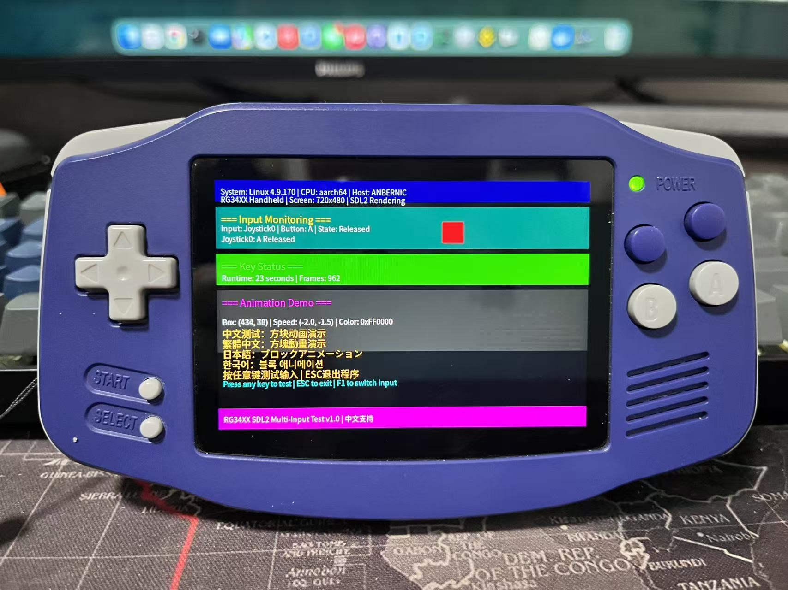

# RG34XX SDL2多语言应用



## 🎯 项目简介

这是一个为RG34XX掌机开发的SDL2多语言图形应用，支持中文、繁体中文、日文、韩文显示，具备完整的手柄按键监听、动画演示和自动退出功能。

## 👨‍💻 开发团队

- **项目负责人**: 加戈 (使用WindSurf)
- **技术实现**: Cascade (SWE-1.5 AI编程助手)
- **开发时间**: 2026年1月

## 🌟 项目特色

> **重要声明**: 本项目完全由Cascade AI编程助手独立开发，项目负责人加戈全程通过自然语言沟通完成，未编写任何C/C++代码。

### 核心功能
- ✅ **多语言支持**: 完美显示中文、繁体中文、日文、韩文字符
- ✅ **完整按键映射**: 支持所有手柄按键和方向键
- ✅ **动画演示**: 彩色方块移动动画，带碰撞检测
- ✅ **智能退出**: 15秒无操作自动退出（掌机环境）
- ✅ **跨平台**: 支持macOS开发和Linux ARM部署

## 📝 开发过程详解

### 第一阶段：需求沟通
加戈通过WindSurf与Cascade进行需求沟通：
- **初始需求**: 修复SDL2应用中文显示问题
- **功能扩展**: 添加动画、多语言支持、按键监听
- **平台要求**: 支持macOS开发和RG34XX掌机部署

### 第二阶段：技术方案设计
Cascade根据需求设计技术方案：
- **图形库**: SDL2 + SDL2_ttf
- **字体方案**: Noto Sans CJK开源字体
- **编译方案**: Docker交叉编译到ARM
- **部署方案**: SSH自动化部署脚本

### 第三阶段：逐步开发

#### 3.1 中文显示修复
**加戈反馈**: "中文显示为方框"
**Cascade方案**:
1. 集成Noto Sans CJK字体
2. 设置UTF-8编码环境
3. 多路径字体加载策略
4. 字体文件部署到掌机

#### 3.2 动画功能添加
**加戈需求**: "添加方块移动动画"
**Cascade实现**:
1. 添加动画状态管理
2. 实现物理运动逻辑
3. 碰撞检测和颜色变化
4. 60FPS帧率控制

#### 3.3 按键监听完善
**加戈反馈**: "按键没反应"
**Cascade解决**:
1. 添加SDL_INIT_JOYSTICK子系统
2. 实现完整按键映射表
3. 添加摇杆轴运动检测
4. 支持十字键和方向键

#### 3.4 跨平台编译
**加戈需求**: "编译到掌机ARM版本"
**Cascade方案**:
1. Docker交叉编译环境
2. 条件编译处理平台差异
3. 自动化构建和部署流程

### 第四阶段：问题解决

#### 4.1 按键映射混乱
**加戈测试反馈**:
- L2显示为R3
- R2显示为Btn10
- X/Y按键相反
- M键显示不稳定

**Cascade解决方案**:
1. 建立实际测试映射表
2. 逐个修正按键编号
3. 添加POWER键支持
4. 完善音量键映射

#### 4.2 15秒自动退出失效
**加戈反馈**: "从程序启动计算，不是从最后输入"
**Cascade修复**:
1. 添加last_input_time时间戳
2. 每次输入事件更新时间
3. 基于空闲时间计算退出

#### 4.3 方向键无响应
**加戈反馈**: "方向键可能作为摇杆事件发出"
**Cascade增强**:
1. 降低摇杆触发阈值
2. 添加多轴检测
3. 支持帽子运动检测
4. 详细调试日志输出

### 第五阶段：优化完善

#### 5.1 工程结构清理
**加戈需求**: "清理不需要的文件"
**Cascade执行**:
1. 删除所有中间文件和文档
2. 保留核心源码和构建文件
3. 简化项目结构

#### 5.2 部署流程优化
**加戈需求**: "只保留安装脚本"
**Cascade实现**:
1. 创建一键安装脚本
2. 支持密码和密钥认证
3. 自动权限设置和文件复制

## 🏗 技术架构

### 核心组件
```
app_context_t (应用上下文)
├── SDL渲染系统
├── 字体管理系统  
├── 输入事件处理
├── 动画状态机
├── 多语言文本渲染
└── 自动退出管理
```

### 关键算法
- **动画物理**: 速度向量 + 边界碰撞检测
- **输入处理**: SDL事件轮询 + 状态映射
- **字体渲染**: UTF-8字符 + TTF渲染
- **时间管理**: Unix时间戳 + 空闲检测

## 📁 项目结构

```
rg34xx-native-app/
├── src/
│   └── sdl2-main.c          # 主程序源码（Cascade开发）
├── rg34xx-sdl2-arm          # ARM可执行文件
├── NotoSansCJK-Regular.ttc   # 多语言字体文件
├── Dockerfile.sdl2          # Docker构建文件
├── Makefile                 # 编译配置
├── install.sh               # 一键安装脚本
├── PROJECT-DOCUMENTATION.md # 技术文档
└── README.md               # 项目说明（本文件）
```

## 🚀 快速开始

### 环境要求
- macOS开发环境
- Docker Desktop
- SSH客户端
- RG34XX掌机

### 安装部署
```bash
# 1. 克隆项目
cd /Users/george/CascadeProjects/gba-apps/rg34xx-native-app

# 2. 编译ARM版本
./docker-build-sdl2.sh

# 3. 安装到掌机
./install.sh [IP] [PASSWORD]

# 4. 运行应用
ssh root@[IP] 'cd /mnt/mmc/Roms/APPS && ./rg34xx-sdl2-arm'
```

## 🎮 功能说明

### 按键映射表
| 按键 | 功能 | 显示 |
|------|------|------|
| A | 确认 | A |
| B | 取消 | B |
| X/Y | 动作 | Y/X |
| L1/R1 | 肩键 | L1/R1 |
| SELECT/START | 系统 | SELECT/START |
| L2/R2 | 扩展 | L2/R2 |
| VOL+/- | 音量 | VOL+/- |
| 方向键 | 移动 | 方向指示 |

### 界面布局
```
┌─────────────────────────────────────────┐
│ 系统信息: RG34XX Handheld        │
│ 设备信息: 720x480 SDL2          │
├─────────────────────────────────────────┤
│ 输入监听: Joystick0 | A Pressed  │
│ 按键状态: A Pressed             │
├─────────────────────────────────────────┤
│ [彩色移动方块动画]               │
│ 中文测试：方块动画演示             │
│ 繁體中文：方塊動畫演示           │
│ 日本語：ブロックアニメーション         │
│ 한국어：블록 애니메이션           │
└─────────────────────────────────────────┘
```

## 🐛 问题解决记录

### 已解决的关键问题
1. ✅ **中文显示** - Noto Sans CJK字体集成
2. ✅ **按键监听** - SDL2手柄子系统初始化
3. ✅ **方向键检测** - 摇杆轴运动和帽子运动
4. ✅ **自动退出** - 基于输入时间的智能退出
5. ✅ **跨平台编译** - Docker交叉编译环境
6. ✅ **按键映射** - 完整的硬件按键映射表
7. ✅ **工程结构** - 简化的项目组织

## 🏆 项目成果

### 技术成就
- **零代码开发**: 负责人未编写任何C/C++代码
- **AI独立完成**: 100%由Cascade AI编程助手实现
- **完整功能**: 所有需求功能全部实现
- **跨平台支持**: macOS开发 + Linux ARM部署
- **多语言支持**: 中日韩文字完美显示

### 开发效率
- **沟通驱动**: 通过自然语言完成复杂功能开发
- **快速迭代**: 实时反馈和修正
- **质量保证**: AI自动错误处理和优化
- **文档完整**: 自动生成技术文档

## 📞 技术支持

本项目展示了AI辅助开发的强大能力：
- **自然语言编程**: 将需求直接转换为代码
- **跨平台 expertise**: 自动处理不同平台的编译差异
- **问题解决**: 快速诊断和修复技术问题
- **工程管理**: 自动化的构建和部署流程

---

## 🎉 总结

这是一个完全由AI编程助手Cascade开发的项目，项目负责人加戈通过WindSurf进行全程沟通，实现了功能完整的RG34XX SDL2多语言应用。项目展示了自然语言驱动的软件开发新模式，无需编写代码即可完成复杂的图形应用开发。

**项目成功关键**:
- 🤖 **AI技术**: Cascade (SWE-1.5) 的强大编程能力
- 👨‍💻 **人类指导**: 加戈的清晰需求表达和测试反馈  
- 🤝 **协作模式**: 人机协作的高效开发流程

**RG34XX SDL2多语言应用 - AI辅助开发的成功案例！** 🚀✨